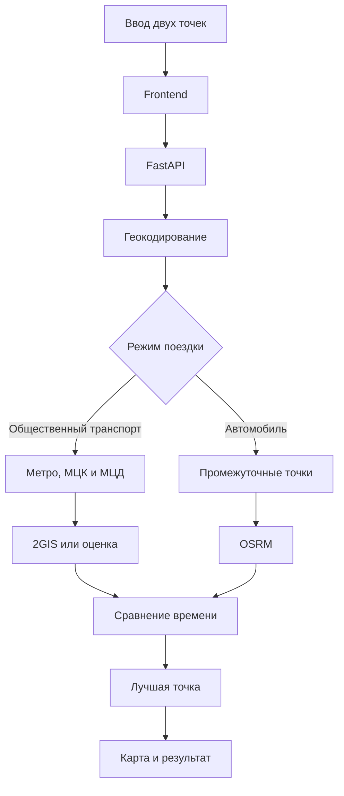

# Я.Карты++

Веб-приложение для поиска справедливого места встречи между двумя участниками.

Сервис принимает две точки отправления, сравнивает продолжительность поездки и предлагает место, до которого участникам потребуется добираться примерно одинаковое время.

Для общественного транспорта приложение выбирает реальную станцию метро, МЦК или МЦД. Для автомобиля рассчитывается промежуточная точка встречи.

## Возможности

- поиск по адресу или названию станции;
- поддержка метро, МЦК и МЦД;
- режим общественного транспорта;
- режим автомобиля;
- поиск места с минимальной разницей во времени;
- отображение результатов на интерактивной карте;
- обработка ошибок внешних сервисов;
- резервный расчёт при исчерпании лимита 2GIS;
- защита API-ключа;
- асинхронные HTTP-запросы;
- автоматические тесты;
- проверка качества кода.

## Технологии

### Backend

- Python 3.11+
- FastAPI
- Pydantic
- pydantic-settings
- HTTPX
- Uvicorn

### Frontend

- HTML
- CSS
- JavaScript
- Leaflet
- OpenStreetMap

### Внешние сервисы

- 2GIS Places API
- 2GIS Public Transport Routing API
- OSRM
- HeadHunter Metro API
- OpenStreetMap

### Тестирование и качество кода

- Pytest
- pytest-asyncio
- RESPX
- Ruff

## Архитектура обработки

1. Пользователь вводит две точки отправления.
2. Пользователь выбирает общественный транспорт или автомобиль.
3. Frontend отправляет запрос в FastAPI.
4. Геокодер преобразует адреса и названия станций в координаты.
5. Сервис встречи формирует список возможных точек.
6. Модуль маршрутизации рассчитывает время поездки.
7. Кандидаты сравниваются по разнице и общей продолжительности поездки.
8. Backend возвращает лучшую точку и альтернативы.
9. Frontend показывает результат и маркеры на карте.



## Режим общественного транспорта

Приложение загружает список станций метро, МЦК и МЦД, выбирает станции рядом с центром маршрута и сравнивает время поездки каждого участника.

Если бесплатный лимит 2GIS доступен, используются данные маршрутизации 2GIS.

Если лимит исчерпан, приложение продолжает работать и использует приблизительную оценку времени по расстоянию. В интерфейсе приблизительный результат отмечается отдельным сообщением.

## Режим автомобиля

Приложение создаёт промежуточные точки между участниками, получает продолжительность автомобильных маршрутов через OSRM и выбирает точку с минимальной разницей во времени.

## Клонирование проекта

```powershell
git clone https://github.com/donette243/maps-plus.git
cd maps-plus
```

## Установка в Windows PowerShell

Создайте виртуальное окружение:

```powershell
py -m venv .venv
```

Разрешите активацию окружения для текущего процесса:

```powershell
Set-ExecutionPolicy -Scope Process -ExecutionPolicy RemoteSigned
```

Активируйте окружение:

```powershell
.\.venv\Scripts\Activate.ps1
```

Обновите pip:

```powershell
python -m pip install --upgrade pip
```

Установите проект и зависимости:

```powershell
pip install -e ".[dev]"
```

## Установка в Linux или macOS

```bash
git clone https://github.com/donette243/maps-plus.git
cd maps-plus
python3 -m venv .venv
source .venv/bin/activate
python -m pip install --upgrade pip
pip install -e ".[dev]"
```

## Настройка переменных окружения

Создайте файл `.env` на основе `.env.example`.

Windows PowerShell:

```powershell
Copy-Item .env.example .env
notepad .env
```

Linux или macOS:

```bash
cp .env.example .env
```

Добавьте ключ 2GIS:

```env
DGIS_API_KEY=your_2gis_api_key
```

Ключ можно получить в 2GIS Platform Manager:

https://platform.2gis.com/

Файл `.env` содержит секретные данные и не должен добавляться в Git.

## Проверка качества кода

```powershell
ruff check .
```

Ожидаемый результат:

```text
All checks passed!
```

## Запуск тестов

```powershell
pytest -q
```

Ожидаемый результат:

```text
6 passed
```

Предупреждения сторонних библиотек Starlette и AnyIO не влияют на работу приложения.

## Запуск приложения

```powershell
uvicorn app.main:app --reload
```

После запуска приложение будет доступно по адресу:

```text
http://127.0.0.1:8000
```

Для остановки сервера нажмите `Ctrl+C`.

## API

### Проверка состояния

```http
GET /api/health
```

### Поиск места встречи

```http
POST /api/meeting-points
```

Поля запроса:

| Поле | Тип | Описание |
|---|---|---|
| `participant_a` | `string` | Первая точка отправления |
| `participant_b` | `string` | Вторая точка отправления |
| `mode` | `string` | `transit` или `driving` |
| `candidate_count` | `integer` | Необязательное количество кандидатов |

Интерактивная документация FastAPI доступна по адресу:

```text
http://127.0.0.1:8000/docs
```

## Ограничения

- бесплатная версия 2GIS ограничивает количество запросов;
- при ответе `429 Too Many Requests` время общественного транспорта рассчитывается приблизительно;
- список метро, МЦК и МЦД ориентирован на Москву и Московскую область;
- автомобильные маршруты рассчитываются через публичный сервер OSRM;
- работа приложения зависит от доступности внешних сервисов и интернет-соединения.

## Лицензия

Проект распространяется по лицензии MIT. Подробная информация находится в файле `LICENSE`.